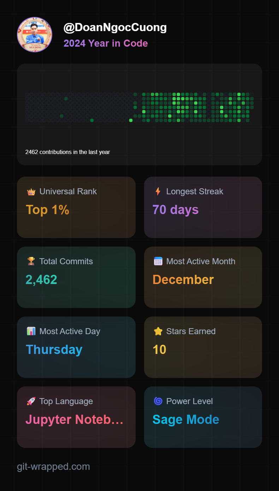
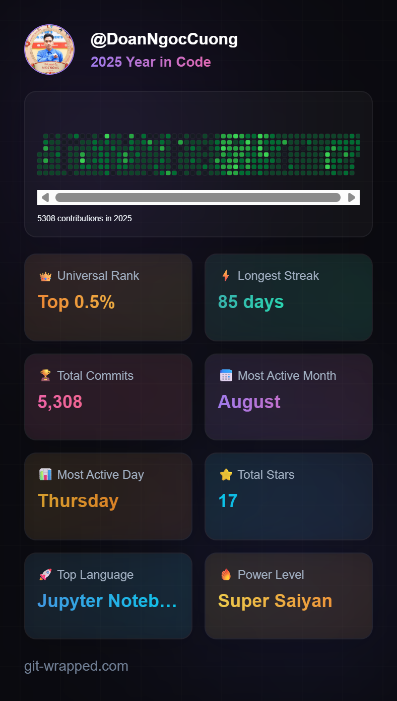
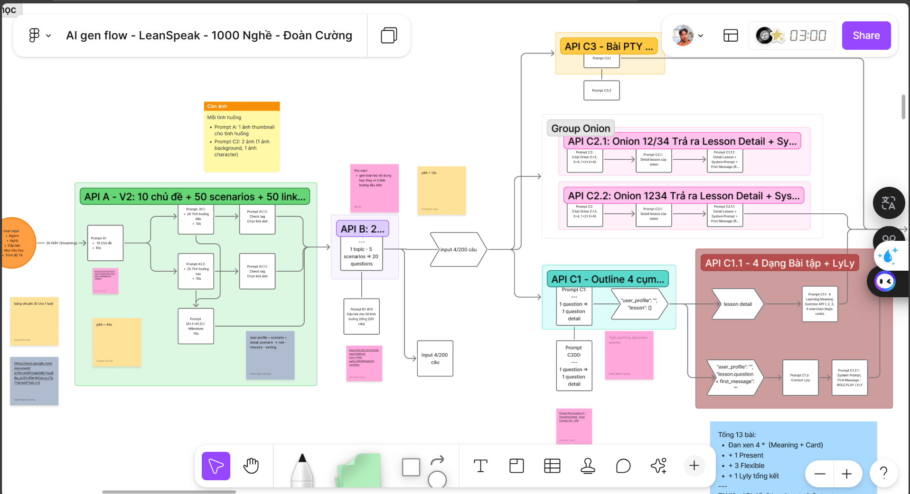

## Hi👋
https://git-wrapped.com/

<!--
**DoanNgocCuong/DoanNgocCuong** is a ✨ _special_ ✨ repository because its `README.md` (this file) appears on your GitHub profile.

Here are some ideas to get you started:

- 🔭 I’m currently working on ...
- 🌱 I’m currently learning ...
- 👯 I’m looking to collaborate on ...
- 🤔 I’m looking for help with ...
- 💬 Ask me about ...
- 📫 How to reach me: ...
- 😄 Pronouns: ...
- ⚡ Fun fact: ...
-->

<!--   -->

# MY ROAD - CON ĐƯỜNG TÔI CHỌN: 

## 1. Mục đích cuối cùng Begin with the end X10 in Mind and The end with the number: Tự do Tâm Trí - X3+GOSINGA. Bonus: Tài chính, Mối quan hệ, Sức khỏe
## 2. Điểm giao mình chọn cho sự nghiệp với Chiến lược đại dương xanh, Tích lũy có system, nhất quán, dài hạn; Tái sử dụng siêu cao : 
1. AI Engineering (NLP, LLM, MLOps, System Desgin, ... = 10 % Research Model (NLP, LLMs, RAG) + 70% Engineering (MLOps, System Design) + 10 % AI Application (Prompting, AI Workflow, Tools, ...) + 10% Product. ) +
2. Creator - KOL Leader Community 
3. Global
4. Investor trường phái đầu tư cơ bản (đầu tư giá trị)
Optional: 
- Academy: Kết hợp với AI Việt Nam Academy, Full Stack Data Science Academy
- Product & Business Model & Consulting AI, Edu, Finance. 

## Basic

CÁC DỰ ÁN CHÍNH TẠI CÔNG TY 1: 

1. Dự án 1000 Nghề 
=> Gen nội dung bài học full cho 1000 Nghề trên App The Coach của công ty 

(app này anh ạ: https://www.thecoach.edu.vn/
) 
+, 1 User bất kỳ nhập các thông tin thì đều được đề xuất ra LỘ TRÌNH HỌC CÁ NHÂN HOÁ

2. là dự án Robot: 
Khá to, em làm 2 phần chính trong này. 
- 1 là đoạn Fast Response của Robot: user nói 1 câu => Fast Response model RobertA để detect ra Intent 
- 2 là Memory của user được gắn vào AI. 
(AI có 2 phần Memory: 1 là Memory dạng knowledge base của RAG để cấp thêm thông tin về chính Robot 
2 là Memory của user => giúp AI cá nhân hoá cho từng user ) 
ạ.

<!--  -->

LIST SẢN PHẨM: 
1. [DoanNgocCuong/MiniProd_Web1_AIWebTestScoring](https://github.com/DoanNgocCuong/MiniProd_Web1_AIWebTestScoring)
2. [DoanNgocCuong/MiniProd_Web2_UIChatbot_throughCallApiRAG](https://github.com/DoanNgocCuong/MiniProd_Web2_UIChatbot_throughCallApiRAG)
3. [DoanNgocCuong/MiniProd_Web3_GradingVidMentorTeaching_StepUpE_T102024: Chấm điểm video mentor](https://github.com/DoanNgocCuong/MiniProd_Web3_GradingVidMentorTeaching_StepUpE_T102024)
4. [DoanNgocCuong/MiniProd_Web4_ContentEngFlow_StepUpE_T102024](https://github.com/DoanNgocCuong/MiniProd_Web4_ContentEngFlow_StepUpE_T102024)
5. [DoanNgocCuong/MiniProd_Web5_TemplateWeb_T12_2024_ContentEngFlow_IELTSStepUpE_T102024](https://github.com/DoanNgocCuong/MiniProd_Web5_TemplateWeb_T12_2024_ContentEngFlow_IELTSStepUpE_T102024)
6. [DoanNgocCuong/MiniProd_Web6_UIChatbot_throughCallApiDIFY](https://github.com/DoanNgocCuong/MiniProd_Web6_UIChatbot_throughCallApiDIFY)
7. [DoanNgocCuong/Unfinish_MiniProd_Web7_LogInLogOut: - Đóng gói 6 hoặc nhiều hơn các tool vào trang Log In, Log Out](https://github.com/DoanNgocCuong/Unfinish_MiniProd_Web7_LogInLogOut)
8. [DoanNgocCuong/MiniProj_Web8_AutoPromptingTuning_T2_2025](https://github.com/DoanNgocCuong/MiniProj_Web8_AutoPromptingTuning_T2_2025)
9. [DoanNgocCuong/MiniProd_Web9_SimulationConversation_UserSimAI_2Prompt_T32025](https://github.com/DoanNgocCuong/MiniProd_Web9_SimulationConversation_UserSimAI_2Prompt_T32025)

## Unfinish
1. [DoanNgocCuong/forked---unfinish---ai-companion---Long-Term-Memory---Memory-Augmented-AI-Agents: Meet Ava, the WhatsApp Agent](https://github.com/DoanNgocCuong/forked---unfinish---ai-companion---Long-Term-Memory---Memory-Augmented-AI-Agents)

# NlpLlmRagAgent

1. [DoanNgocCuong/MiniProd_RAG1_FlashRAG_2024_StepUpEducation: MiniProd_RAG1_FlashRAG_2024_StepUpEducation](https://github.com/DoanNgocCuong/MiniProd_RAG1_FlashRAG_2024_StepUpEducation)
2. [DoanNgocCuong/MiniProj_RAG3_chatbot_vietcunaModel_QdantDB_Legal2008Text_ngrokTunneling: NTTU Chatbot - A student support chatbot using LLM + Document Retriever (RAG) in Vietnamese](https://github.com/DoanNgocCuong/MiniProj_RAG3_chatbot_vietcunaModel_QdantDB_Legal2008Text_ngrokTunneling/settings)
3. Rag
4. [DoanNgocCuong/MiniProj_RAG4_BusinessAnalysisSchool_ITE10HUST_20231: rag integrate with auto-crawling pipeline](https://github.com/DoanNgocCuong/MiniProj_RAG4_BusinessAnalysisSchool_ITE10HUST_20231)
5. [DoanNgocCuong/Research_RAG5_SpProjGraduation_aHuy_T122024: The official implementation of RAPTOR: Recursive Abstractive Processing for Tree-Organized Retrieval](https://github.com/DoanNgocCuong/Research_RAG5_SpProjGraduation_aHuy_T122024)
6. [DoanNgocCuong/pipelines_OpenWebUI_aPartOf_RAG5_LegalRAGChatbot_JobMoney: Pipelines: Versatile, UI-Agnostic OpenAI-Compatible Plugin Framework](https://github.com/DoanNgocCuong/pipelines_OpenWebUI_aPartOf_RAG5_LegalRAGChatbot_JobMoney)
[DoanNgocCuong/MiniProj_RA
G5_OpenWebUI_add_PipelineRAG_LegalRAGChatbot_JobMoney](https://github.com/DoanNgocCuong/MiniProj_RAG5_OpenWebUI_add_PipelineRAG_LegalRAGChatbot_JobMoney)
7. [DoanNgocCuong/MiniProj_RAG3_RAG6_LegalChatbot_16032025](https://github.com/DoanNgocCuong/MiniProj_RAG3_RAG6_LegalChatbot_16032025)
   
## Awesome: 
1. [DoanNgocCuong/awesome-llm-apps---AI-Agents: Collection of awesome LLM apps with AI Agents and RAG using OpenAI, Anthropic, Gemini and opensource models.](https://github.com/DoanNgocCuong/awesome-llm-apps---AI-Agents)

## Agents: 
[DoanNgocCuong/MiniProj_Agent1_mem0-supadatabase_LongTermMemory_MemoryAugmentedAIAgents](https://github.com/DoanNgocCuong/MiniProj_Agent1_mem0-supadatabase_LongTermMemory_MemoryAugmentedAIAgents)

## Basic Tasks: 
1. https://github.com/DoanNgocCuong/BasicTasks_Benchmark_Suna_IIAgent_19062025

---

## Đôi dòng giới thiệu: 
Dưới đây là bản format lại theo cấu trúc rõ ràng, giữ nguyên nội dung gốc:

---

**Họ và tên:** Đoàn Ngọc Cường  
**Facebook:** [https://www.facebook.com/doanngoccuong.nhathuong](https://www.facebook.com/doanngoccuong.nhathuong)  
**Github:** [github.com/DoanNgocCuong](github.com/DoanNgocCuong)  

---

### **Thông tin cá nhân:**
1. **Tên:** Cường  
 
2. **Background học tập:** Data Science and AI   
3. **Công việc hiện tại:** AI Intern - công ty AI Production mảng Education AI   
4. **Định hướng tương lai:** NLP, LLMs, RAG, Workflow and AI Agents   
5. **Sở thích:** học tập phát triển bản thân, hack speed, Networking   

---

### **Background:**  
Data Science and AI - (BKHN) 2021  

---

### **Current Job:**  
- AI Intern
- AI Engineering: NLP, LLMs, RAG, Workflow and AI Agents  

---

### **Lý do chính và mục tiêu muốn đạt được trong khoá:**  
1. Networking: Connect với nhiều Mentor và Ace trong ngành  
2. Chuyên môn kiến thức  

---

### **Định hướng gần:**  
- AI Engineering:  
  - Database Optimization  
  - NLP, LLMs, RAG, Workflow and AI Agents  
  - MLOps  

---

### **Định hướng xa:**  
1. Connect with many community AI and build community ở xung quanh mình  
2. Kèm 1-1 Mentoring mảng AI, Agency AI  
3. Business  

---

# Buy Me a Coffee
- Techcombank: 1903 7650 9000 16
- DOAN NGOC CUONG
- Thank so much!

---
Thank to https://github.com/phatjkk/phatjkk?tab=readme-ov-file -> so I have knowed about this README.md

=========

# Loạt dự án đã làm và sắp làm

Intro: Đôi điều giới thiệu về bản thân em và dự án đã làm - hiện đang làm - và sắp tới ạ. 
1. P1: https://youtu.be/acuF9o7nQSY

2. P2: https://youtu.be/BfUkOGvD298
3. P3: https://youtu.be/tyqsiSTShJI

--
Summary 
1. Dự án 1000 nghề Workflow (chain of Prompt) Build bài tự động - công ty 
(Build lộ trình tiếng anh cho 1000 nghề: thả cho tôi nghề của bạn, tôi sẽ có lộ trình học tiếng anh cá nhân hoá cho bạn trong 5min) 
- Làm chính 100% luồng

2. Dự án Robot - công ty: Workflow bài học + Agent 
(Đối tượng: Trẻ em học tiếng anh, vui, robot như 1 người bạn tri kỉ) 
- Hiện đang refactor lại từ dự án code bằng python thuần của 1 anh trong công ty => sang Langchain, LangGraph

3. Dự án CFO AI Agent: Hiện đang làm (1 người anh start up bên Mỹ) 
Gợi ý ra quyết định cho CFO, tiến tới thay thế và cắt giảm nhân sự, nhân viên tài chính thông thường
- Đang làm 1 mình MVP - và tìm ae khác cùng làm 

4. Dự án Sale AI Agent - cuộc thi VP Bank, track Senior (giải quyết bài toán trên hệ thống Saleforce)  
- in the future

5. Dự án Productivity AI Agent App
1 App start up của 1 anh người Việt, app về Productivity (tích hợp: gg calendar, pomodoro, task manager, ...) core AI - thời gian tới 
- in the future

Chi tiết 5 dự án em có nói trong 3 videos
Chi tiết hơn ae mình có thể thảo luận thêm. Hiện em cũng đang có bài toán và tìm kiếm các ae cùng làm 
Nếu các anh oke, và có nguồn lực, em sẵn sàng share dự án, ae có cách chia hợp lý với nhau ạ. 

Thank anh ạ, nếu được ae mình có thể triển đường dài ạ.

